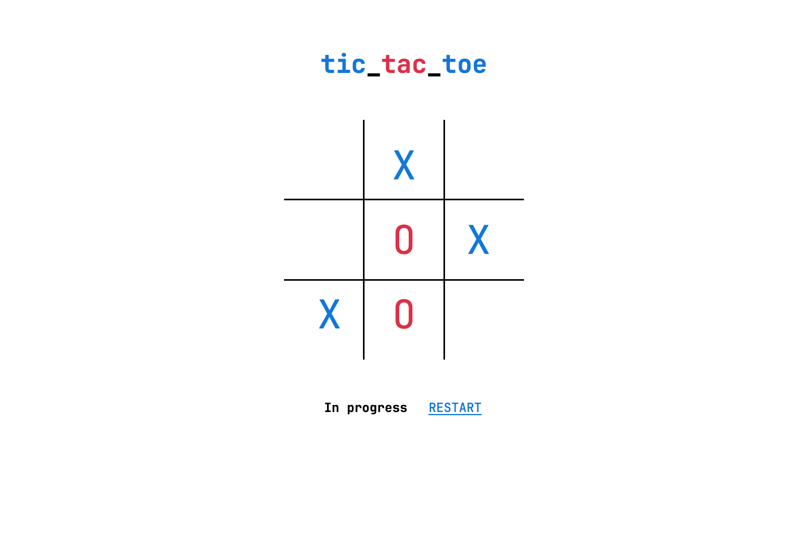
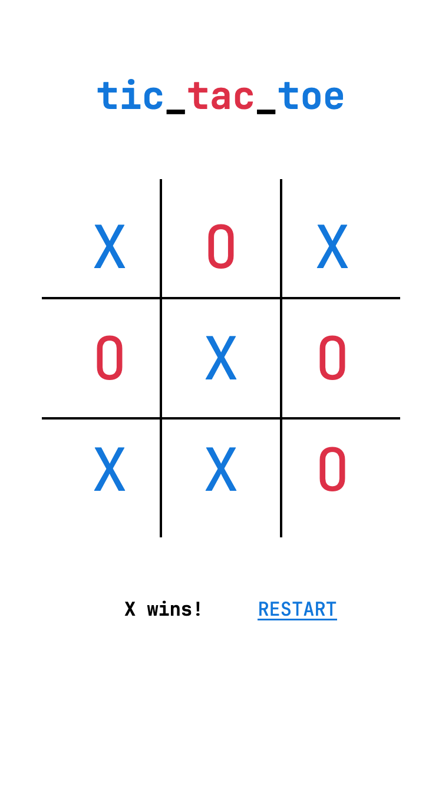

# Tic Tac Toe
Made using HTML + CSS and JS as a fun side project. Enjoy!

## Objective
Get three of your pieces in a row, column, or diagonal before the other player does.

## Screenshots
 

## Demos
Codepen: [https://codepen.io/joshualai/pen/gOyybvr](https://codepen.io/joshualai/pen/gOyybvr)
